# 🚀 AI & Automation Solutions for Cross-Border E-commerce
**(跨境电商 AI 全栈自动化解决方案)**

> **Enterprise-grade Solution Suite**: Integrated with **SDXL Image Generation**, **Multimodal Risk Control (Qwen-VL)**, and **RPA Operations**.
>
> 本项目是一套完整的电商技术闭环系统：从 AIGC 批量生产素材，到海量图片去重清洗，再到智能侵权风控，最终实现自动化上架。旨在为 Temu/TikTok 卖家提供**“无人值守”**级别的运营效率。

---

## 🏗️ System Architecture (系统架构)

```mermaid
graph TD
    %% 定义样式
    classDef ai fill:#e1f5fe,stroke:#01579b,stroke-width:2px;
    classDef data fill:#f3e5f5,stroke:#4a148c,stroke-width:2px;
    classDef rpa fill:#e8f5e9,stroke:#1b5e20,stroke-width:2px;
    classDef storage fill:#fff3e0,stroke:#e65100,stroke-width:2px,stroke-dasharray: 5 5;

    %% 输入层
    subgraph Input_Layer [Production Input / 生产输入]
        A([原始参考图 / Reference Images]) --> B[02. AIGC 流水线]
    end

    %% 处理核心
    subgraph Core_Engine [AI Processing Core / 核心引擎]
        direction TB
        
        %% 模块1：生图
        B --> |SDXL + IP-Adapter| C[批量异化生成]
        C --> |OpenCV| D[智能抠图与合成]
        
        %% 模块2：去重
        D --> E{03. 视觉数据引擎}
        E -- 重复 --> F[隔离区 / Quarantine]
        E -- 唯一 --> G[待审核库]
        
        %% 模块3：风控
        G --> H{01. 智能风控系统}
        H -- High Risk --> I[拦截 / 报警]
        H -- Low Risk --> J[成品库 / Ready to List]
    end

    %% 基础设施
    subgraph Infrastructure [Infrastructure / 基础设施]
        DB[(SQLite / Local Cache)]:::storage
        LOG[Logs & Monitoring]:::storage
        H <--> DB
        E <--> DB
    end

    %% 交付层
    subgraph Delivery_Layer [Deployment / 交付层]
        J --> K[04. RPA 上架机器人]
        K --> L(Temu / TikTok 后台)
    end

    %% 应用样式
    class B,C,D,H ai;
    class E,F,G data;
    class K,L rpa;
```



---

## 📸 System Live Demo (实装演示)

### 1. 智能 TRO 风控系统
**核心价值：** 基于 Qwen-VL 多模态大模型，实时检测侵权风险，支持本地缓存加速，误判率低于 5%。


### 2. SDXL 服装生产流水线
**核心价值：** 自动化生成异化图案，并进行光影融合与智能抠图，实现“无人值守”式商品图生产。


### 3. 视觉数据去重引擎
**核心价值：** 基于 pHash + SSIM 算法，对海量图片进行毫秒级去重，支持 SQLite 增量索引。


### 4. RPA 自动上架机器人
**核心价值：** 可视化任务队列管理，支持多店铺环境隔离与自动上传。


---

## 📂 Core Modules (核心模块)

本项目由四个独立的子系统组成，点击标题可进入对应子项目查看源码与文档：

### 1. [🔥 01-Smart-Risk-Control-System](./01-Smart-Risk-Control-System)
*   **功能**：**智能侵权风控系统**。基于 Qwen-VL 多模态大模型，实时检测图片中的 IP、商标侵权风险。
*   **亮点**：通过本地指纹缓存策略，将 API 调用成本降低 **80%**，支持多线程并发审计。
*   **入口**：`tro_risk_analyzer.py`

### 2. [🎨 02-AIGC-Fashion-Pipeline](./02-AIGC-Fashion-Pipeline)
*   **功能**：**服装 AIGC 生产线**。基于 SDXL 1.0 + IP-Adapter，实现保持原图风格的异化裂变。
*   **亮点**：内置“智能抠图 (Smart Cutout)”与“光影融合”算法，自动输出 3:4 标准电商主图。
*   **入口**：`sdxl_generation_engine.py`

### 3. [🔍 03-Visual-Data-Engine](./03-Visual-Data-Engine)
*   **功能**：**视觉数据处理引擎**。针对海量素材库的高性能去重工具。
*   **亮点**：结合 **pHash (感知哈希)** 与 **SSIM (结构相似性)** 算法，支持增量索引与毫秒级比对。
*   **入口**：`deduplication_engine.py`

### 4. [🤖 04-Cross-Border-RPA-Bot](./04-Cross-Border-RPA-Bot)
*   **功能**：**跨境电商 RPA 机器人**。自动化 Listing 生成与上架工具。
*   **亮点**：集成浏览器指纹管理与 Excel 数据流处理，实现多店铺环境隔离与无人值守上架。
*   **入口**：`web/temu_listing_generator.py`

---

## 🛠️ Tech Stack (技术栈)

*   **Languages**: Python 3.10+
*   **GenAI**: PyTorch, Diffusers (SDXL), Qwen-VL (Aliyun SDK), IP-Adapter
*   **CV Algorithms**: OpenCV, Pillow, Scikit-image, ImageHash
*   **GUI Framework**: PyQt6, Tkinter, Eel (Web-GUI)
*   **Data & Storage**: Pandas, SQLite (WAL Mode), JSON
*   **Automation**: Selenium, DrissionPage

---

## 🚀 Quick Start (快速开始)

1.  **Clone the repository**
    ```bash
    git clone https://github.com/ziyima375-v1/AI-Ecommerce-Solutions.git
    cd AI-Ecommerce-Solutions
    ```

2.  **Install Dependencies**
    ```bash
    pip install -r requirements.txt
    ```

3.  **Run Modules**
    Please refer to the `README.md` in each sub-folder for detailed usage.

---

## 📬 Contact
*   **Role**: AI Solutions Architect / Python Automation Engineer
*   **Email**: [ziyima375@gmail.com]
*   **GitHub**: [ziyima375-v1](https://github.com/ziyima375-v1)

---
*MIT License © 2025*